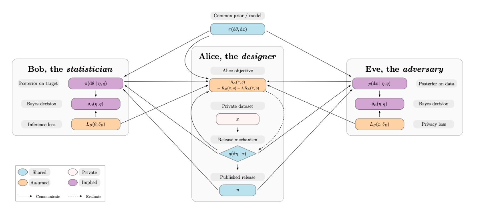

# Bayesian Adversarial Privacy (BAP)

This repository contains the code (Python/JAX notebooks) and figures accompanying the paper **"Bayesian Adversarial Privacy"**.

<p align="center">
  
</p>

## Contents

### Notebooks
- `notebooks/example1_cointoss.ipynb`
  Reproduces **Example 1 (Coin toss)**: integrated risks and plots.

- `notebooks/example2_gaussian.ipynb`
  Reproduces **Example 2 (Gaussian model, JAX)**: Cases 1–6, mean/max adversaries, integrated risks and figures.

### Figures
- `figures/paper/`
  Figures used in the main manuscript (typically reporting $R_A$) for the two examples.

- `figures/supplementary/`
  Additional diagnostics reported in the Supplementary Material (e.g. panels for $R_B$, $R_E$, and $R_A$).

### Tables
- Tables used in the paper.

## Reproducing the results

After installation, launch Jupyter and run the notebooks:

```bash
jupyter notebook notebooks/
```

- **`example1_cointoss.ipynb`**: runs in a few seconds (exact arithmetic + LP).
- **`example2_gaussian.ipynb`**: runs in a few minutes (JAX numerical integration over 6 release mechanisms).

Figures are saved to `figures/` and tables to `tables/`.

## Installation

You can either use a Python virtual environment (`venv`) or a Conda environment.
The notebooks are tested with **Python 3.10.13**.

### Option 1: Python `venv` (Python 3.10.13 recommended)

Using **pyenv** (to enforce Python 3.10.13 in this directory):

```bash
pyenv local 3.10.13
python -m venv .venv
source .venv/bin/activate  # macOS / Linux
# On Windows:
# .venv\Scripts\activate

pip install --upgrade pip
pip install -r requirements.txt
```

### Option 2: Conda environment

```bash
conda create -n bap python=3.10.13
conda activate bap
pip install -r requirements.txt
```
